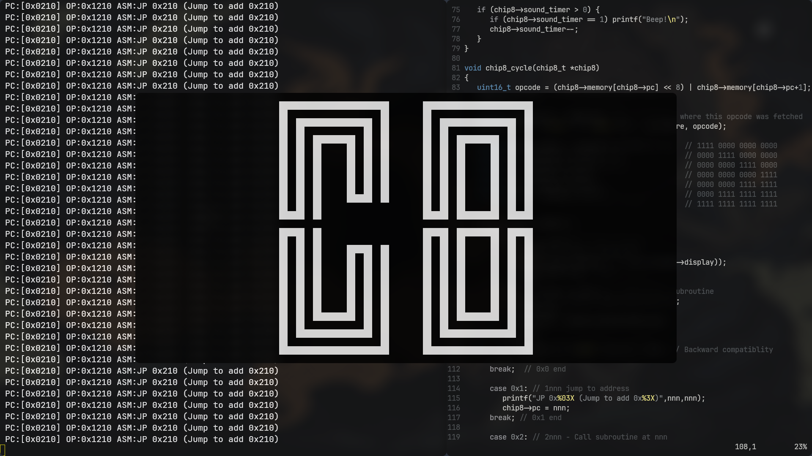

# CHIP-8 Emulator

A complete, educational CHIP-8 emulator using SDL2 and C.



## Features

- **Full CHIP-8 Instruction Set**: Implements all 35 original CHIP-8 instructions
- **SDL2 Graphics**: Clean display with 20x scaling (1280×640 window)
- **Input**: Hexadecimal keypad mapping with proper keyboard input
- **Sound Support**: Basic beep sound via console output (easily extendable)
- **Performance**: Runs at approximately 500Hz with proper timing
- **Educational Design**: Well-commented code with detailed explanations of emulation concepts

### Prerequisites

- GCC compiler
- SDL2 development libraries

### build
```bash
make
```

## Usage

```bash
./build/chip8 <path-to-rom>
```

### Key Mapping
The CHIP-8 hexadecimal keypad (4×4) is mapped to your keyboard:

```
CHIP-8 Keypad      Keyboard Layout
┌───┬───┬───┬───┐    ┌───┬───┬───┬───┐
│ 1 │ 2 │ 3 │ C │    │ 1 │ 2 │ 3 │ 4 │
├───┼───┼───┼───┤    ├───┼───┼───┼───┤
│ 4 │ 5 │ 6 │ D │    │ Q │ W │ E │ R │
├───┼───┼───┼───┤    ├───┼───┼───┼───┤
│ 7 │ 8 │ 9 │ E │    │ A │ S │ D │ F │
├───┼───┼───┼───┤    ├───┼───┼───┼───┤
│ A │ 0 │ B │ F │    │ Z │ X │ C │ V │
└───┴───┴───┴───┘    └───┴───┴───┴───┘
```

- **ESC**: Exit the emulator

### Adding Debug Output
Uncomment or add `printf` statements in `chip8_cycle()` to trace instruction execution.

---
